## Часть 1. Установка ОС

Скачать установочный образ ОС https://old-releases.ubuntu.com/releases/20.04/\
Скачать программу для виртуализации https://www.virtualbox.org/wiki/Downloads

Создание виртуальной машины
  - Запустить VirtualBox 
  - Нажать Создать
  - Задать имя виртуальной машины
  - Выбрать образ ICO -> Далее
  - Задать имя пользователя и пароль. Задать имя хоста -> Далее
  - Задать количество оперативной памяти. Задать количество процессоров -> Далее
  - Создать новый виртуальный диск. Выбрать размер диска -> Далее -> Готово

Установка ОС
  - Запускаем созданную машину в VirtualBox
  - Выбрать язык
  - Продолжить без обновления
  - Выбрать раскладку клавиатуру -> Готово
  - Настройка сети -> Готово
  - Настройка прокси-сервера -> Готово
  - Настройка сервера обновлений -> Готово
  - Разметка диска -> Готово
  - Конфигуратор хранилища -> Готово
  - Подтвердить разрушительное действие -> Продолжить
  - Настройка учетной записи
    - Задать имя
    - Задать название сервера
    - Задать имя пользователя и пароль
    - Готово
  - Подтверждаем необходимость установки OpenSSH сервера
  - Импортировать идентификатор SSH - НЕТ -> Готово
  - Выбираем рекомендуемые снимки сервера -> Готово
  - Выбор компонентов сервера -> Готово
  - Установка завершена - Ожидаем скачивание и установку обновлений систем безопасности
  - По окончании установки -> Перезагрузка

Ввести логин и пароль.

Узнать версию Ubuntu, выполнив команду `cat /etc/issue.`

>>Ввод команды `cat /etc/issue`.

## Часть 2. Создание пользователя

Создать нового пользователя в группе adm. Команда `sudo useradd -g adm <имя>`.

>Создание пользователя.

Проверить пользователя путем ввода команды
`cat /etc/passwd`.

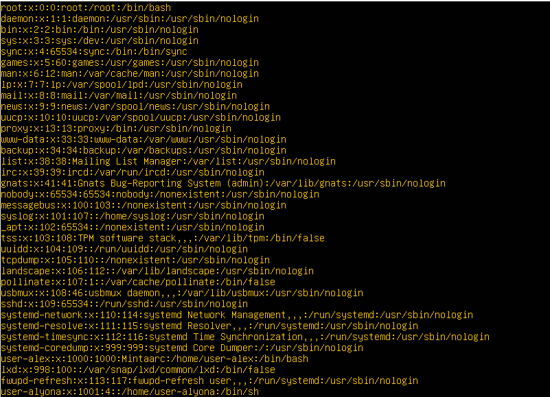

>Результат работы команды `cat /etc/passwd`.

## Часть 3. Настройка сети ОС

Установить имя машины как user-1. Команда `sudo hostname <имя>`.

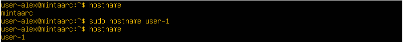

>Переименование машины.

Установить временную зону, соответствующую вашему текущему местоположению.

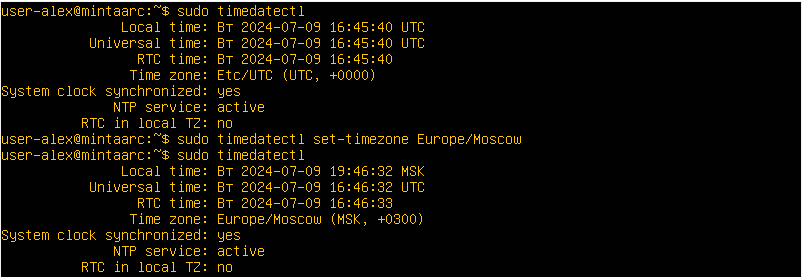

>Установка временной зоны.

Вывести названия сетевых интерфейсов с помощью консольной команды.

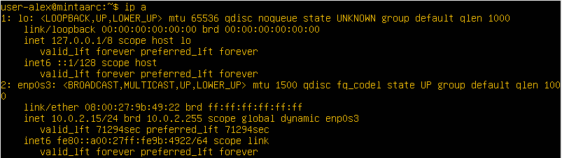

>Вызов команды для вывода названий сетевых интефейсов.

***lo (loopback device)** – виртуальный интерфейс, присутствующий по умолчанию в любом Linux. Он используется для отладки сетевых программ и запуска серверных приложений на локальной машине. С этим интерфейсом всегда связан адрес 127.0.0.1. У него есть dns-имя – localhost. Посмотреть привязку можно в файле /etc/hosts.*

Использовать консольную команду, чтобы получить IP-адрес устройства, с которым вы работаете, от DHCP-сервера.

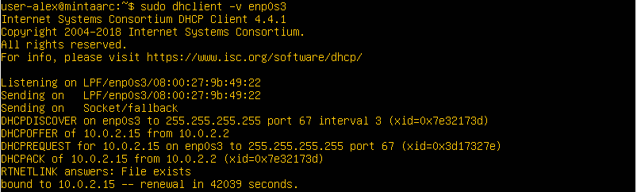

>Вызов команды для получения ip адреса текущего устройства от DHCP-сервера.

***Dynamic Host Configuration Protocol (DHCP)** — автоматический предоставляет IP адреса и прочие настройки сети (маску сети, шлюз и т.п) компьютерам и различным устройствам в сети. Клиент настроенный на получение адреса по протоколу DHCP посылает запрос к серверу, и тот в свою очередь предоставляет свободный IP адрес клиенту во временное пользование — так сказать в аренду. Срок аренды IP адреса настраивается на сервере. DHCP позволяет значительно уменьшить затраченное время на настройку сети, так же позволяет подключать клиента из одной сети в другую без изменения сетевых параметров. Для провайдеров услуг — DHCP позволяет съэкономить на пуле IP адресов, и присвоить статический IP любому оборудованию.*

Определить и вывести на экран внешний ip-адрес шлюза (ip) и внутренний IP-адрес шлюза, он же ip-адрес по умолчанию (gw).

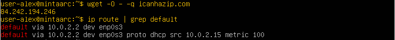

>Вызов команд для определения внешнего и внутреннего ip-адреса шлюза.

Задать статичные (заданные вручную, а не полученные от DHCP сервера) настройки ip, gw, dns (использовать публичный DNS серверы, например 1.1.1.1 или 8.8.8.8).

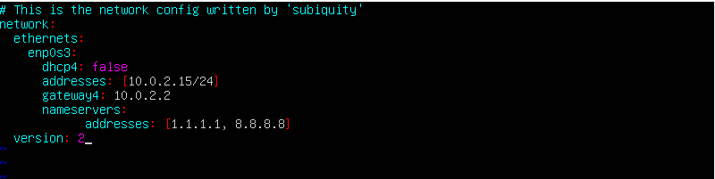

>Для изменения настроек вводим команду `sudo vim /etc/netplan/00-installer-config.yaml`, отключаем dhcp и добавляем адреса.

Перезагрузить виртуальную машину путем ввода команды `sudo reboot`. Убедиться, что статичные сетевые настройки (ip, gw, dns) соответствуют заданным в предыдущем пункте.

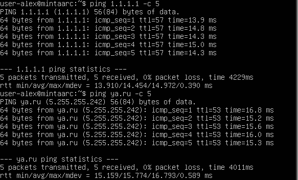

>Пинг удаленных хостов 1.1.1.1 и ya.ru.

## Часть 4. Обновление ОС

Обновить системные пакеты до последней версии. Команды:

	sudo apt update
        
	sudo apt upgrade

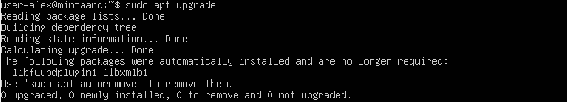

>Пинг удаленных хостов 1.1.1.1 и ya.ru.

## Часть 5. Использование команды sudo

Разрешить пользователю, созданному в Части 2 , выполнять команду sudo.

	sudo usermod -aG sudo localuser

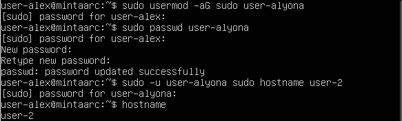

>Создание пароля ранее созданному пользователю и вызов команды для переименования машины.

***sudo (Super User DO)** - утилита, позволяющая строго определенным пользователям выполнять команды с правами администратора.*

## Часть 6. Установка и настройка службы времени

Настроить службу автоматической синхронизации времени.

	sudo apt install ntpdate
    
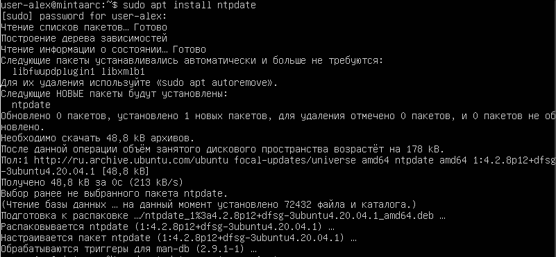

>Настройка службы автоматической синхронизации времени.

	timedatectl show

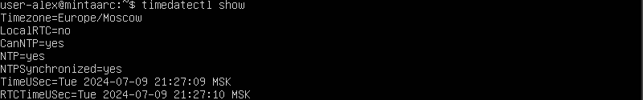

>Вывод команды должен содержать NTPSynchronized=yes.

## Часть 7. Установка и использование текстовых редакторов

##### VIM

Установить текстовый редактор VIM.

	sudo apt install vim

Cоздать файл **test_vim.txt**. 

	vim test_vim.txt

Написать в нём свой никнейм, закрыть файл с сохранением изменений: чтобы редактировать файл нажать `i`, после ввода текста `esc` для перехода в командный режим . Для выхода с сохранением изменений ввести команду `:wq` или `ZZ`

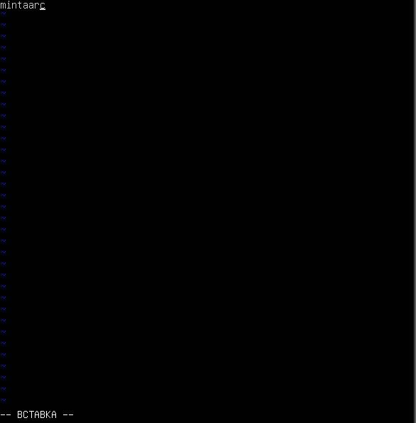

>Cодержимое файла test_vim.txt перед закрытием.

Отредактировать файл, заменив никнейм на строку *"21 School 21"*, закрыть файл без сохранения изменений. Редактирование файла: удаляем первую строку в командном режиме `dd`, затем входим в режим редактирования `i`, набираем текст. Для выхода без сохранениния изменений ввести команду `:q!`.

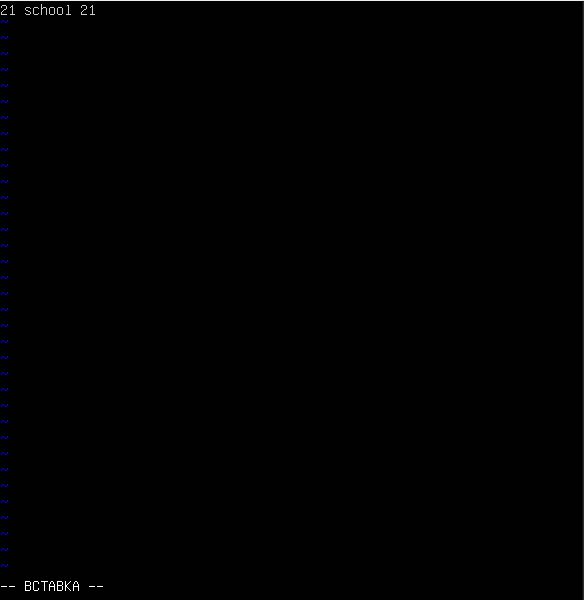

>Cодержимое файла test_vim.txt после редактирования перед закрытием.

Поиск по содержимому файла. Поиск осуществляется через команду `/<find_text>`.

>Результаты поиска слова.

Заменить слово на любое другое. Команда для замены слова на другое `:s/<find_text>/<replace_text>`.

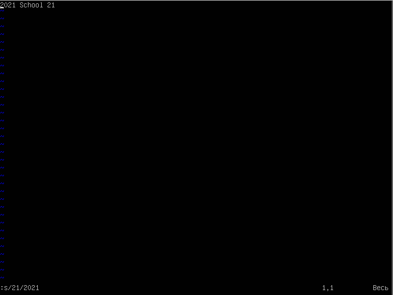

>Результаты замены слова.

##### NANO

Установить текстовой редактор NANO.

	sudo apt install nano
    
Cоздать файл **test_nano.txt**. 

	nano test_nano.txt

Написать в нём свой никнейм, закрыть файл с сохранением изменений: чтобы редактировать файл нужно вводить текст. Для выхода с сохранением изменений нажать `control + x`, затем `y` и `enter`.

>Cодержимое файла test_nano.txt перед закрытием.

Отредактировать файл, заменив никнейм на строку *"21 School 21"*, закрыть файл без сохранения изменений. Редактирование файла: удаляем первую строку, набираем нужный текст. Для выхода без сохранениния изменений нажать `control + x`, затем `n`.

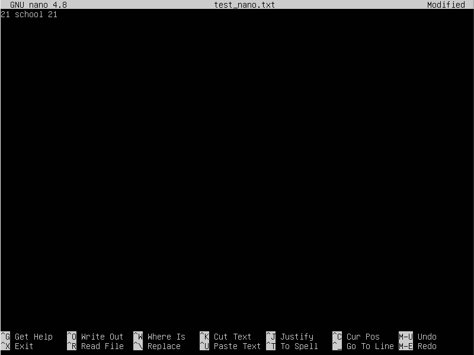

>Cодержимое файла test_nano.txt после редактирования перед закрытием.

Поиск по содержимому файла. Поиск осуществляется через нажатие `control + w` и ввода искомого слова, затем `enter`.

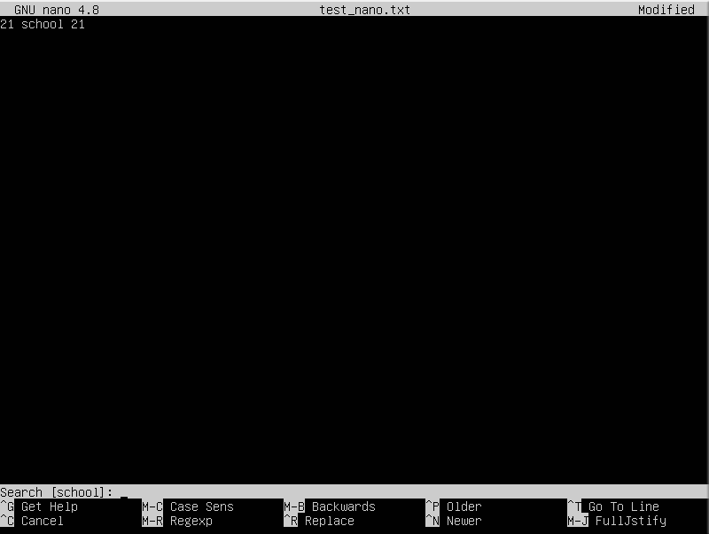

>Результаты поиска слова.

Заменить слово на любое другое. Команда для замены слова на другое `control + \`, вводим искомое слово, затем `enter`, вводим замену, `enter`, и `y` или `a`.

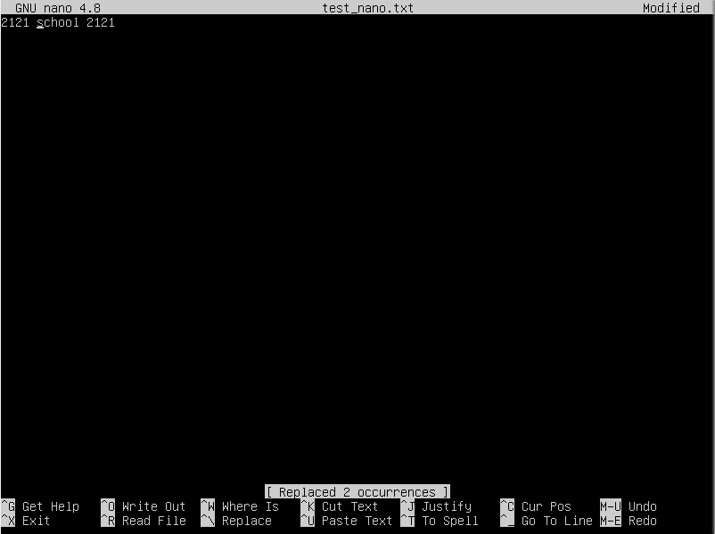

>Результаты замены слова.

##### MCEDIT

Установить текстовой редактор MCEDIT.

	sudo apt install mcedit
    
Cоздать файл **test_mcedit.txt**. 

	mcedit test_mcedit.txt

Написать в нём свой никнейм, закрыть файл с сохранением изменений: чтобы редактировать файл нужно вводить текст. Для выхода с сохранением изменений нажать `esc` или `F10`, затем выбрать `Да` и `enter`.

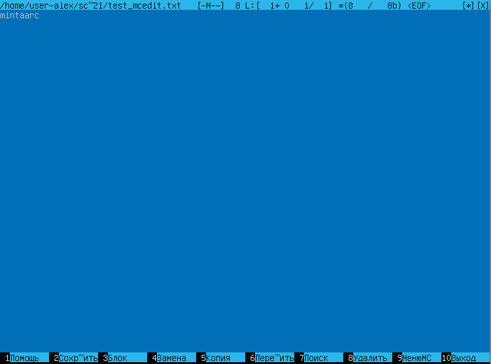

>Cодержимое файла test_mcedit.txt перед закрытием.

Отредактировать файл, заменив никнейм на строку *"21 School 21"*, закрыть файл без сохранения изменений. Редактирование файла: удаляем первую строку, набираем нужный текст. Для выхода с сохранением изменений нажать `esc` или `F10`, затем выбрать `Нет` и `enter`.

>Cодержимое файла test_mcedit.txt после редактирования перед закрытием.

Поиск по содержимому файла. Поиск осуществляется через нажатие `F7` и ввода искомого слова, затем `enter`, курсор должен находится перед искомым словом.

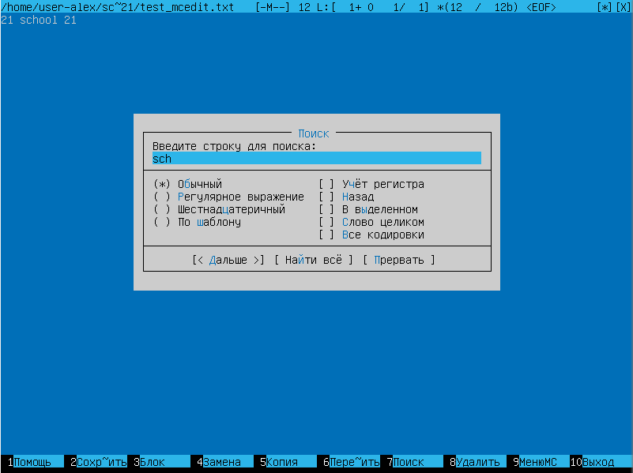

>Результаты поиска слова.

Заменить слово на любое другое. Команда для замены слова на другое `F4`, вводим искомое слово, вводим замену, `enter`, и еще раз `enter`.

>Результаты замены слова.

## Часть 8. Установка и базовая настройка сервиса SSHD

Установить службу **SSHd**.

	sudo apt update
	sudo apt install ssh

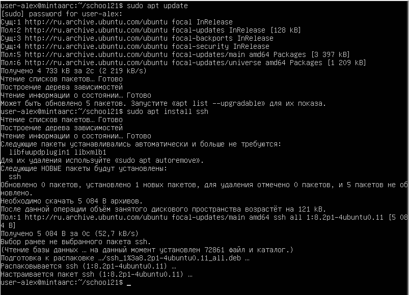

>Обновление и установка SSH.

	sudo apt install openssh-server

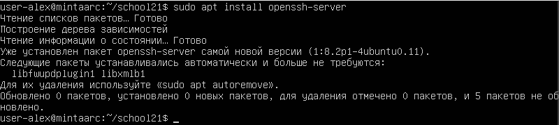

>Установка OpenSSH.

Добавить автостарт службы при загрузке системы.

	sudo systemctl enable ssh
    sudo systemctl status sshd

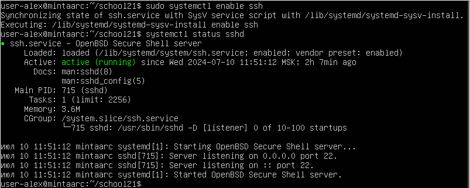

>Автостарт службы SSHd.

Перенастроить службу SSHd на порт 2022.

	sudo vim /etc/ssh/sshd_config
    
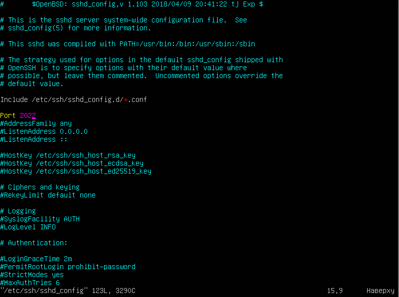

>Настройка порта службы SSHd в файле конфигурации.

Перезапустить службу.

	sudo systemctl restart sshd

Используя команду `ps`, показать наличие процесса sshd.

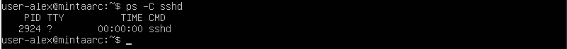

>Вызов команды `ps` с ключом `-C` для вывода процесса по его имени.

`ps` - команда, которая выводит статистику и информацию о состоянии процессов в системе, в том числе ИД процесса или нити, объем выполняемого ввода-вывода и используемый объем ресурсов процессора и памяти. 
Список ключей: 
* -A, -e, (a) - выбрать все процессы; 
* -a - выбрать все процессы, кроме фоновых; 
* -d, (g) - выбрать все процессы, даже фоновые, кроме процессов сессий; 
* -N - выбрать все процессы кроме указанных; 
* -С - выбирать процессы по имени команды; 
* -G - выбрать процессы по ID группы; 
* -p, (p) - выбрать процессы PID; 
* --ppid - выбрать процессы по PID родительского процесса; 
* -s - выбрать процессы по ID сессии; 
* -t, (t) - выбрать процессы по tty; 
* -u, (U) - выбрать процессы пользователя.

Перезагрузить систему.

	sudo reboot

Вывод команды netstat -tan

	sudo apt install net-tools
    netstat -tan
    
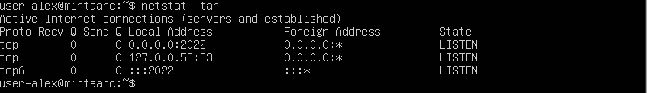

>Вызов команды `netstat` с ключом `-tan`.

Список ключей: 
* -t - Отображение текущего подключения в состоянии переноса нагрузки с процессора на сетевой адаптер при передаче данных ( "offload" ); 
* -a - Отображение всех подключений и ожидающих портов; 
* -n - Отображение адресов и номеров портов в числовом формате.

**Proto** - Протокол, используемый сокетом.\
**Recv-Q** - Счётчик байт не скопированных программой пользователя из этого сокета.\
**Send-Q** - Счётчик байтов, не подтверждённых удалённым узлом.\
**Local Address** - Адрес и номер порта локального конца сокета. Если не указана опция --numeric (-n), адрес сокета преобразуется в каноническое имя узла (FQDN), и номер порта преобразуется в соответствующее имя службы.\
**Foreign Address** - Адрес и номер порта удалённого конца сокета. Аналогично "Local Address."\
**State** - Состояние сокета.\
**0.0.0.0** -  это немаршрутизируемый адрес IPv4, который используется в качестве адреса по умолчанию или адреса-заполнителя.

## Часть 9. Установка и использование утилит top , htop

Установить и запустить утилиты **top** и **htop**.

##### Top

	top

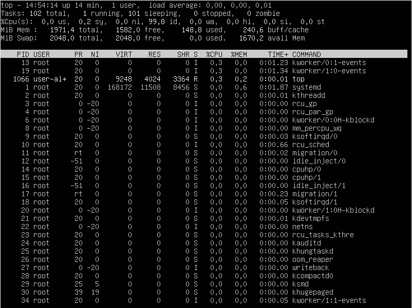

>Вызов команды `top`.

* uptime - 14:00 
* количество авторизованных пользователей - 1 
* общая загрузка системы - 0.00, 0.00, 0.01
* общее количество процессов - 102 
* загрузка cpu - 0.0 us, 0.2 sy, 0.0 ni, 99.8 id, 0.0 wa, 0.0 hi, 0.0 si, 0.0 st 
* загрузка памяти - 1971.4 total, 1582.0 free, 148.8 used, 240.6 buff/cache 
* pid процесса занимающего больше всего памяти - 1
* pid процесса, занимающего больше всего процессорного времени - 1

##### Htop

	htop
    
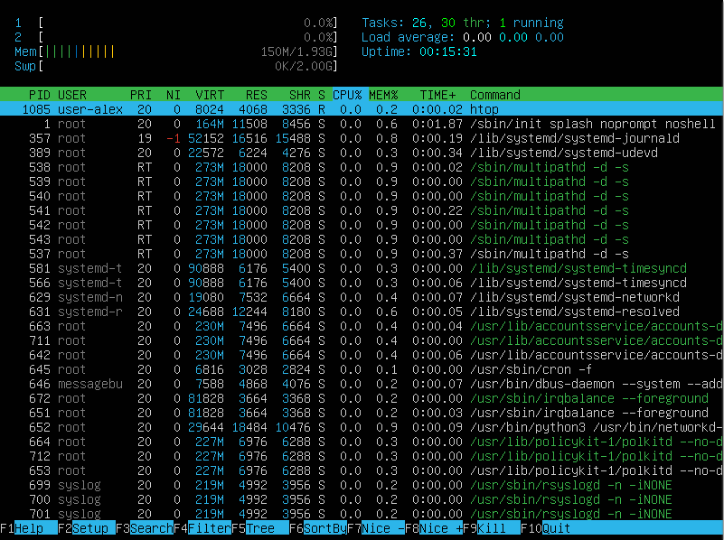

>Вызов команды `htop`.

С помощью клавиши `F6` можно осуществлять сортировку процессов.

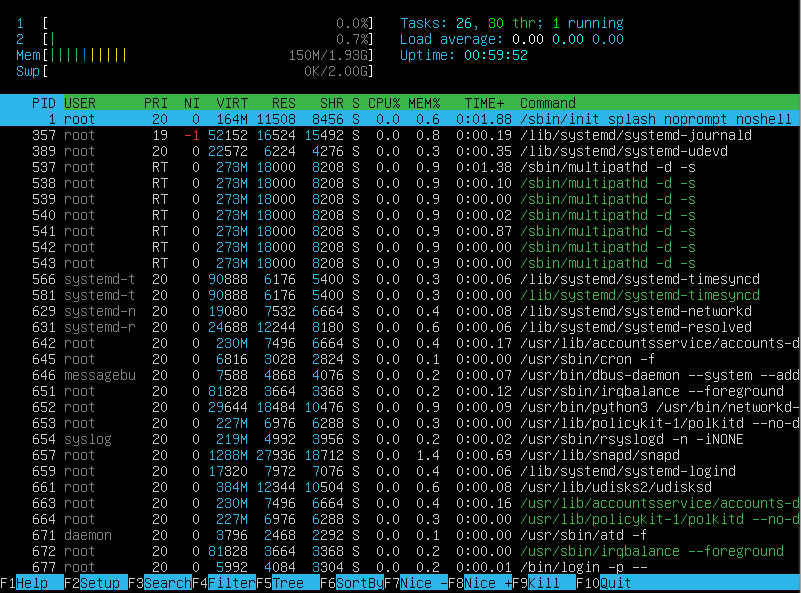

>Вызов команды `htop` и сортировка по **PID**.

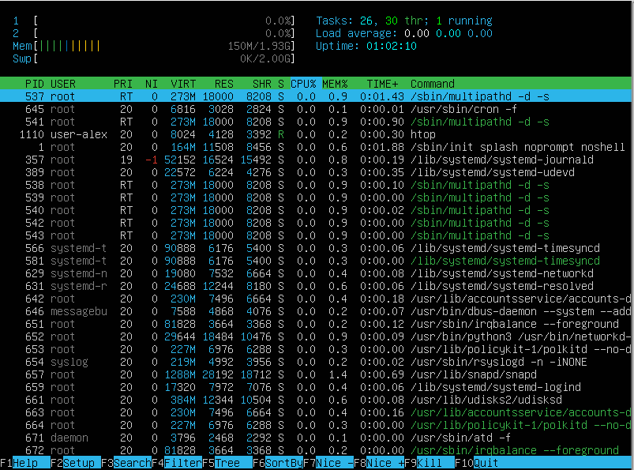

>Вызов команды `htop` и сортировка по **PERCENT_CPU**.

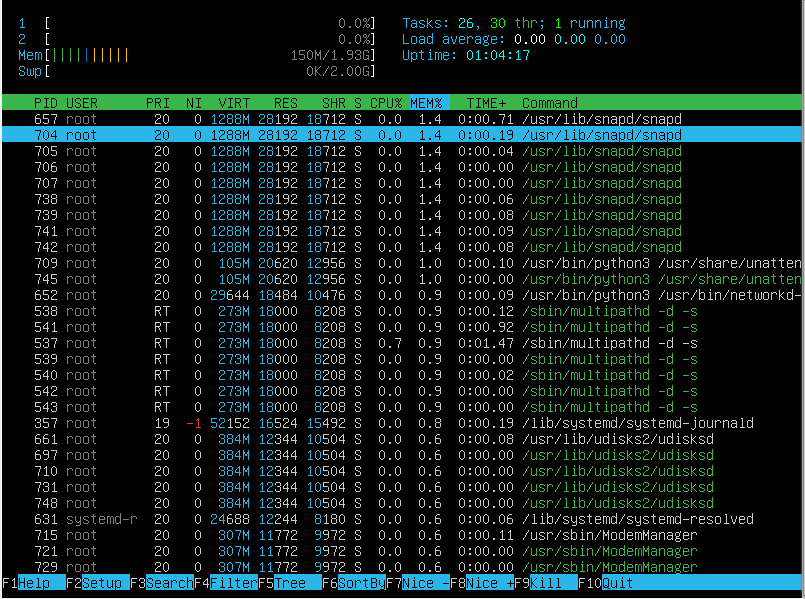

>Вызов команды `htop` и сортировка по **PERCENT_MEM**.

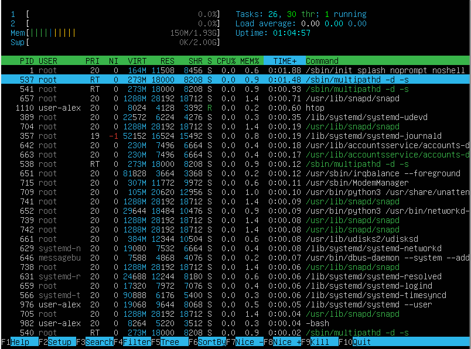

>Вызов команды `htop` и сортировка по **TIME**.

С помощью клавиши `F4` можно установить фильтр процесса.

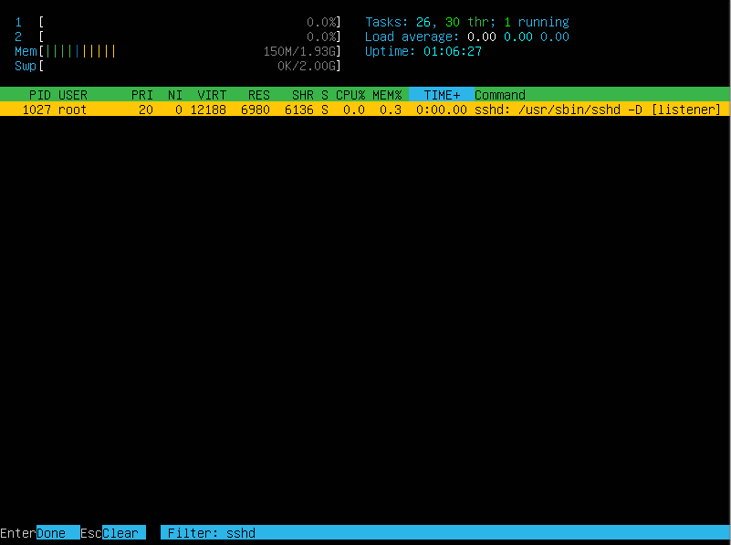

>Вызов команды `htop` и фильтр по **sshd**.

С помощью клавиши `F3` можно осуществить поиск.

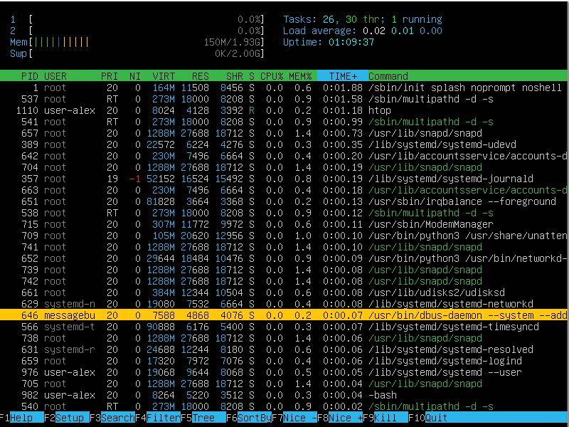

>Вызов команды `htop` и поиск по **syslog**.

С помощью клавиши `F2` можно осуществить настройку вывода информации и добавить нужные показатели.

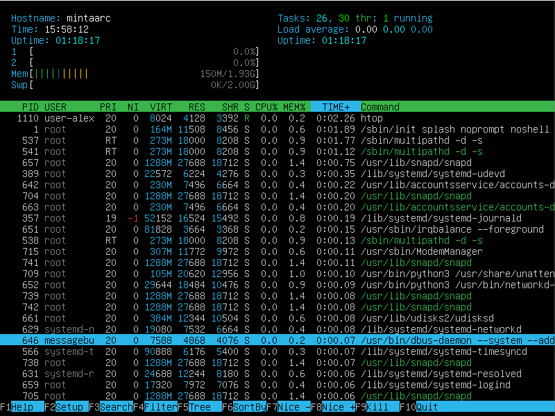

>Вызов команды `htop`, добавлен вывод **hostname**, **clock** и **uptime**.

## Часть 10. Использование утилиты fdisk

Запустить команду `fdisk -l`.

	sudo fdisk -l

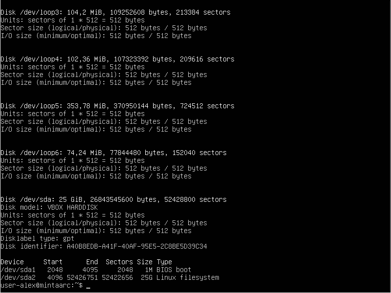

>Вызов команды для получения информации о жёстком диске.

*Название жесткого диска - sda;\
Размер - 25Gib;\
Количество секторов - 52428800.*

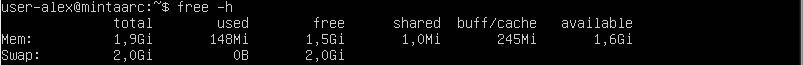

>Вызов команды `free -h` для получения информации о разделе подкачки.

Pазмер **swap**: 2.0 GiB.

## Часть 11. Использование утилиты df

Запустить команду `df` для корневого раздела.

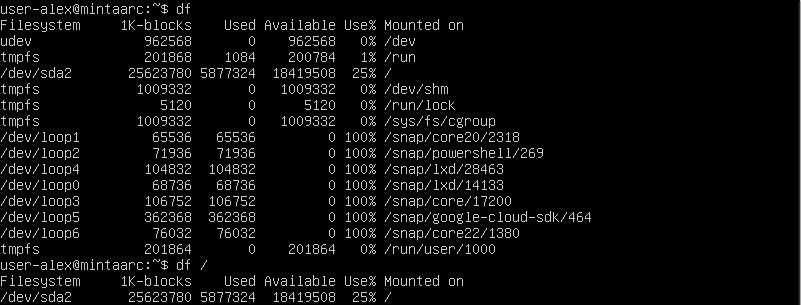

>Вызов команды для получения информации о дисковом пространстве.

*Размер раздела - 25623780;\
Размер занятого пространства - 5877324;\
Размер свободного пространства - 18419508;\
Процент использования - 25;\
Единица измерения в выводе - 1K-blocks (килобайт).*

Запустить команду `df -Th` для корневого раздела.

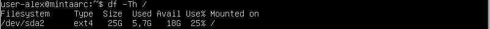

>Вызов команды для получения информации с типом файловой системы и размерами в читаемом виде.

*Размер раздела - 25G;\
Размер занятого пространства - 5.7G;\
Размер свободного пространства - 18G;\
Процент использования - 25;\
Тип файловой системы для раздела - ext4.*

## Часть 12. Использование утилиты du

Запустить команду `du`.

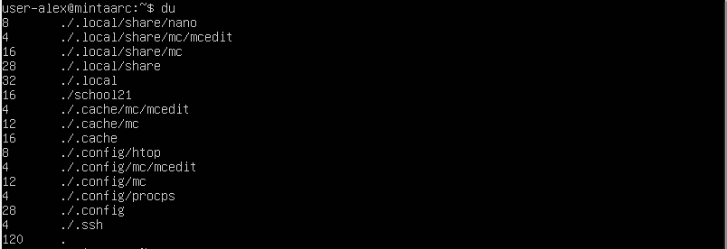

>Вызов команды для получения информации о размере всех файлов в определённой папке

Вывести размер папок **/home**, **/var**, **/var/log** (в байтах, в человекочитаемом виде).

	sudo du -sb /home /var/log /var

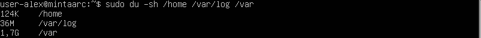

>Вызов команды для получения информации о размере папок /home, /var, /var/log в человекочитаемом виде.

Вывести размер всего содержимого в **/var/log** (не общее, а каждого вложенного элемента, используя *)

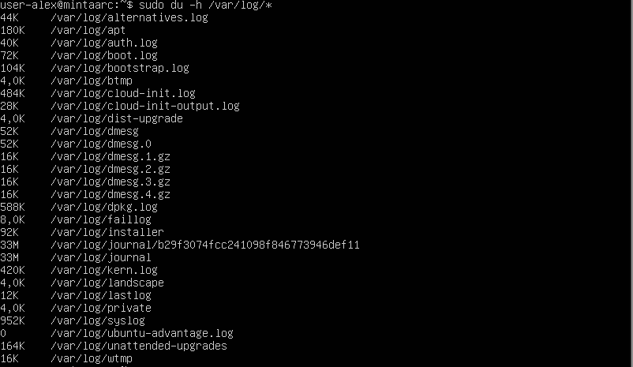

>Вызов команды для получения информации о размере всего содержимого в /var/log в человекочитаемом виде.

## Часть 13. Использование утилиты ncdu

Установить утилиту `ncdu`.

	sudo apt install ncdu

Вывести размер папок **/home**, **/var**, **/var/log**.

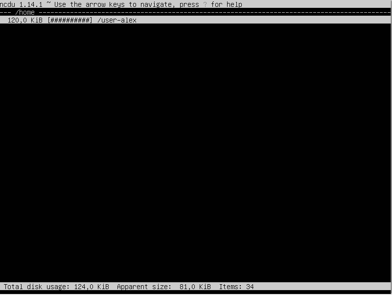

>Вызов команды `ncdu /var`.

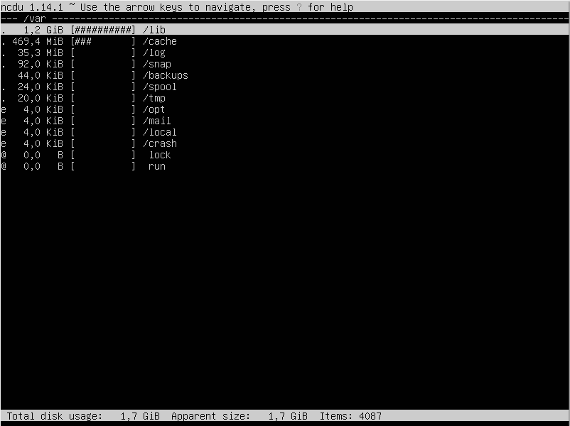

>Вызов команды `ncdu /var/log`.

>Вызов команды `ncdu /home`.

Размер примерно такой же, как в [Часть 12](#part-12-использование-утилиты-du).

## Часть 14. Работа с системными журналами

Открыть для просмотра **/var/log/dmesg**.

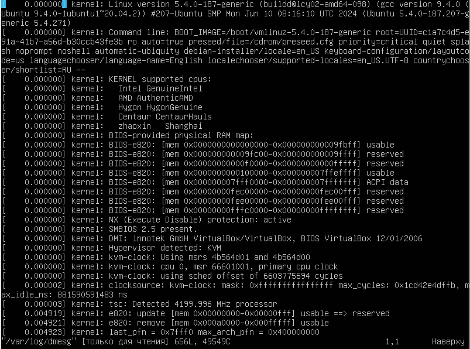

>Вывод файла /var/log/dmesg.

Открыть для просмотра **/var/log/syslog**.

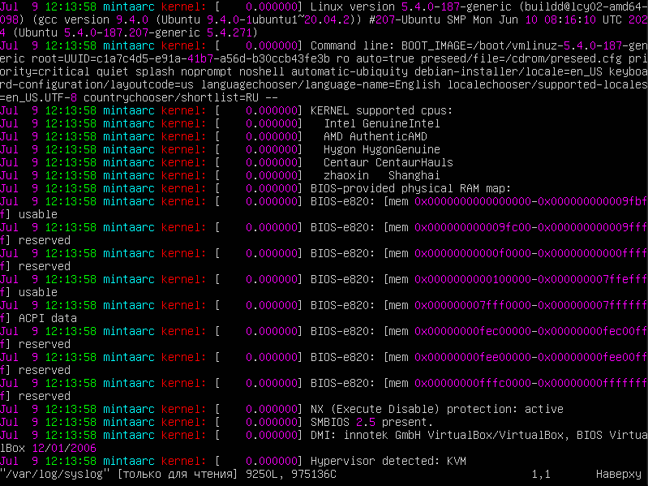

>Вывод файла /var/log/syslog.

Открыть для просмотра **/var/log/auth.log**.

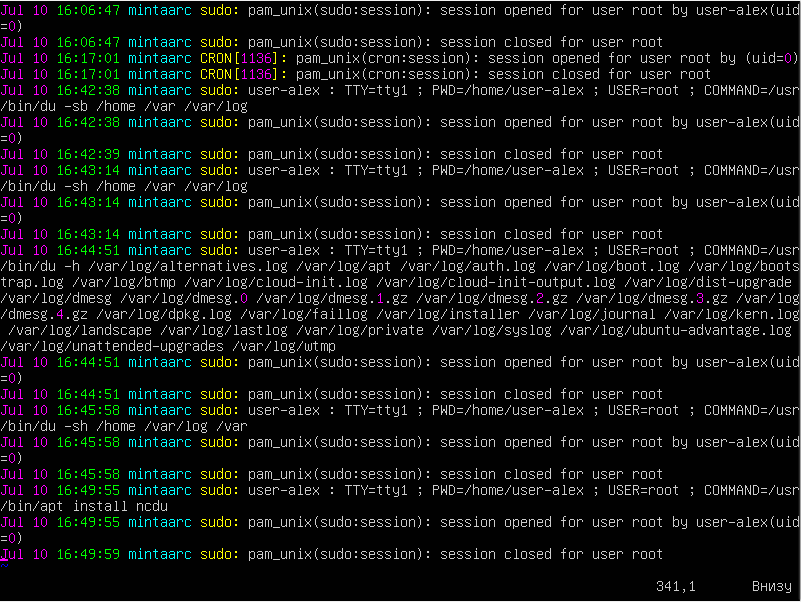

>Вывод файла /var/log/auth.log.

*Время последней успешной авторизации - Jul 10 16:49:55;\
Имя пользователя - mintaarc;\
Метод входа в систему - pam_unix.*

Перезапустить службу SSHd.

	sudo systemctl restart sshd

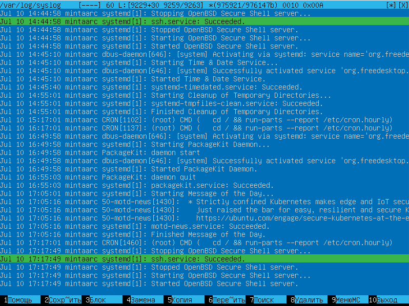

>Вывод файла /var/log/syslog с сообщением о рестарте службы SSHd с помощью поиска в редакторе mcedit.

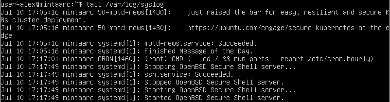

>Вывод файла /var/log/syslog с сообщением о рестарте службы SSHd с помощью команды `tail`.

## Часть 15. Использование планировщика заданий CRON

Используя планировщик заданий, запустить команду uptime через каждые 2 минуты.

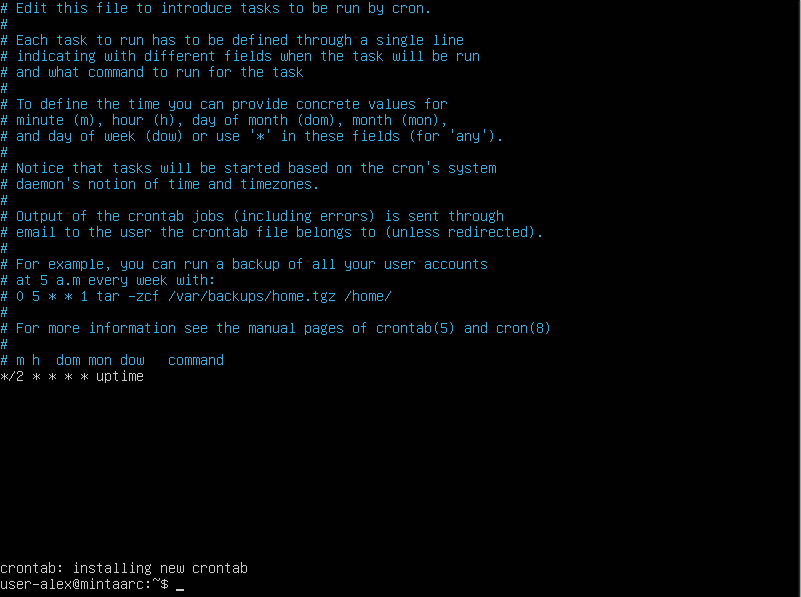

>Редактирование планировщика задач, путем добавления новой строки с текстом */2 * * * * uptime.

Найти в системных журналах строчки (минимум две в заданном временном диапазоне) о выполнении.

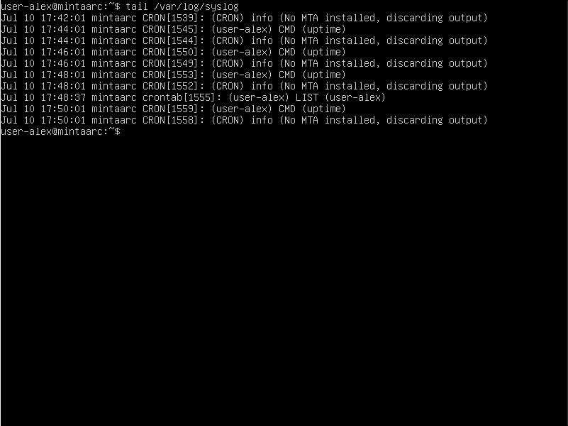

>Вывод данных из файла /var/log/syslog со строками о выполнении запуска команды uptime через каждые 2 минуты.

Вывести на экран список текущих заданий для CRON.

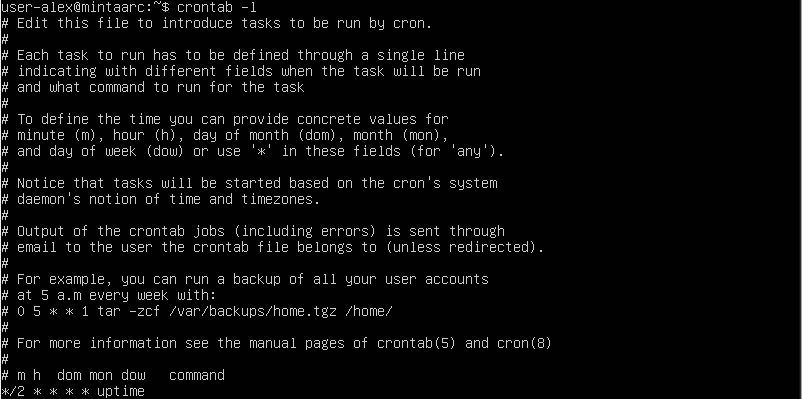

>Вывод списка текущих заданий для CRON.

Удалить все задания из планировщика заданий.

>Для очистки планировщика используем команду `crontab -r`. Команда `crontab -l` показывает пустой список заданий.

